# Piyasa Nabzı Türkiye — YAT/KAP Merkezi

Bu repository, **KAP aktif YF/Y yatırım fonu evrenini** v9.6 kurallarıyla tarar; fon adı, başlangıç yılı, risk seviyesi ve işlem durumunu resmî kaynak zinciriyle doğrular; kalıcı checkpoint üzerinden kaldığı yerden devam eder ve kalite eşiği geçildiğinde public JSON üretir.

v9.6 ile iki yeni TEFAS kaynağı üretim sistemine eklenmiştir:

- `POST /api/funds/fonProfilBilgiGetir`
  - `riskDegeri`
  - `tefasDurum`
  - `isinKodu`
  - `kapLink`
- `POST /api/funds/fonGetiriBazliBilgiGetir`
  - toplu `riskDegeri`
  - toplu `tefasDurum` teşhisi

TLY, BCK ve DKC canlı testleri sonucunda aşağıdaki kurallar doğrulanmıştır:

- TLY: KAP risk `7` = TEFAS profil risk `7` = TEFAS toplu risk `7`.
- BCK ve DKC: KAP sonucu `KAPALI` iken TEFAS profil `TEFAS'ta işlem görüyor` ve işlem listesi eşleşmesi `EVET`; nihai işlem durumu `AÇIK` kabul edilir.
- TEFAS `riskDegeri` bazı fonlarda gerçekten `null` olabilir. Bu durumda risk uydurulmaz ve alan boş bırakılır.

---

## 1. Büyük Resim — Veri Mimarisi

Sistem beş katmandan oluşur:

1. **Evren katmanı:** KAP aktif YF/Y fon listesi.
2. **KAP ayrıştırma katmanı:** Genel Bilgiler HTML ve Yatırımcı Bilgi Formu PDF.
3. **TEFAS zenginleştirme katmanı:** Profil, toplu risk, işlem listesi ve 60 aylık başlangıç serisi.
4. **Kalıcı çalışma katmanı:** Checkpoint, retry sayıları, çatışmalar ve diagnostics.
5. **Yayın katmanı:** Kalite eşiği geçildikten sonra resmî JSON.

### Genel Akış Diyagramı

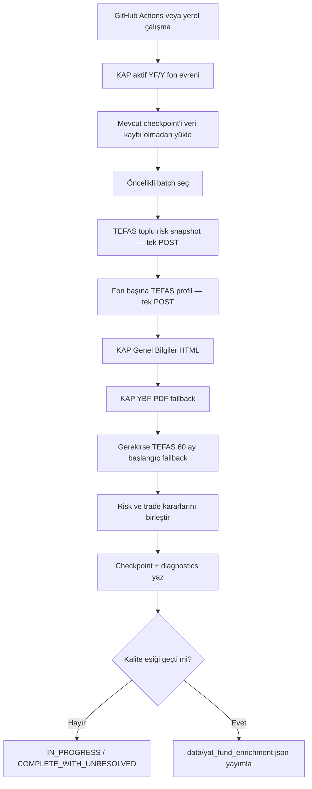

---

## 2. Yayınlanan Ana Alanlar

| Alan | Anlamı | Birincil kaynak | Kontrollü yedek |
|---|---|---|---|
| `fund_name` | Resmî fon adı | KAP aktif YF/Y listesi | Eski doğrulanmış kayıt |
| `start_year` | Fon başlangıç yılı | KAP HTML | KAP PDF → TEFAS 60 ay JSON |
| `risk_level` | Risk seviyesi 1–7 | KAP HTML | KAP PDF → TEFAS toplu → TEFAS profil |
| `trade_status` | Nihai işlem durumu | TEFAS profil `tefasDurum` | TEFAS işlem listesi → KAP sonucu |
| `transaction_status` | Geriye dönük uyumluluk alanı | `trade_status` ile aynı | — |

### Yeni v9.6 Kanıt Alanları

Public JSON ve checkpoint aşağıdaki doğrulama alanlarını da taşır:

- `risk_source`
- `risk_confidence`
- `risk_conflict_flag`
- `risk_tefas_comparison`
- `tefas_profile_risk_raw`
- `tefas_bulk_risk_raw`
- `kap_transaction_status`
- `kap_transaction_source`
- `kap_tefas_status_comparison`
- `tefas_status_raw`
- `tefas_status_normalized`
- `tefas_internal_conflict`
- `tefas_traded_list_match`
- `tefas_traded_list_status`
- `transaction_conflict_flag`
- `tefas_profile_checked_at`
- `tefas_profile_api_status`
- `tefas_profile_isin`
- `tefas_profile_kap_link`

### Alan Veri Mimarisi

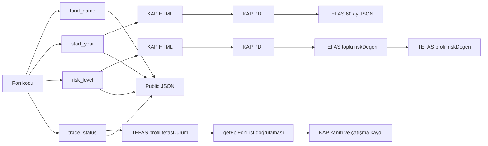

---

## 3. Kaynak Önceliği

### Genel Kaynak Sırası

```text
KAP aktif liste / KAP görünür HTML
        >
KAP Yatırımcı Bilgi Formu PDF
        >
TEFAS doğrulanmış JSON alanları
        >
Eksik bırakma — tahmin yapmama
```

TEFAS kaynakları alan bazında kullanılır. TEFAS risk fallback’i, geçerli KAP riskini ezmez. TEFAS profil işlem durumu ise açık ve doğrudan bir işlem kanıtı olduğu için KAP sonucuyla çatıştığında nihai işlem durumunu düzeltebilir; eski KAP sonucu ayrıca saklanır.

### Kaynak Üstünlüğü Diyagramı

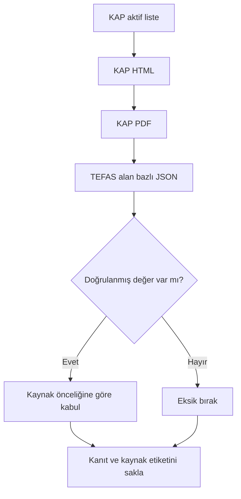

---

## 4. Fon Adı

Fon adı KAP aktif `YF/Y` ana listesindeki resmî addır. Profil JSON’daki ad teşhis amacıyla saklanabilir; KAP ana liste adı otomatik olarak profil adıyla ezilmez.

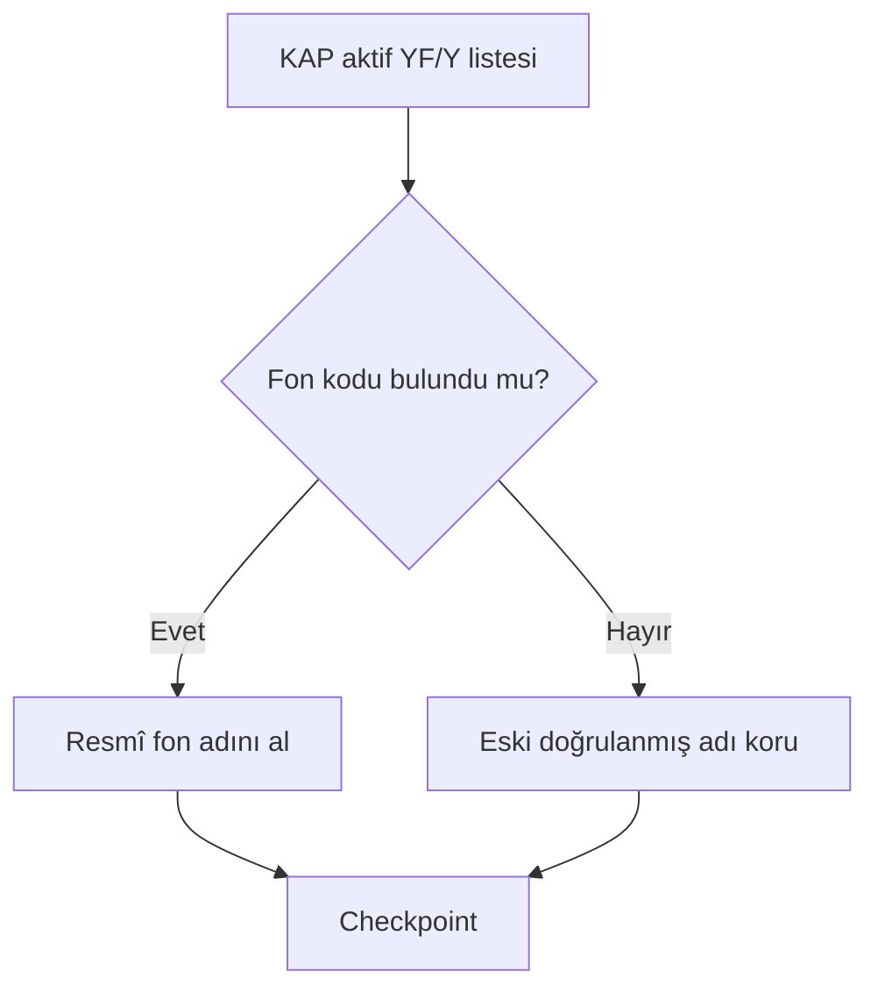

---

## 5. Başlangıç Tarihi / Yılı

### Kaynak Zinciri

1. KAP Genel Bilgiler görünür HTML.
2. KAP Yatırımcı Bilgi Formu PDF.
3. İlk iki kaynak sonuç üretmezse TEFAS 60 aylık fiyat JSON’u.
4. Hiçbir kaynak güvenilir sonuç üretmezse alan boş kalır.

### Başlangıç Akışı

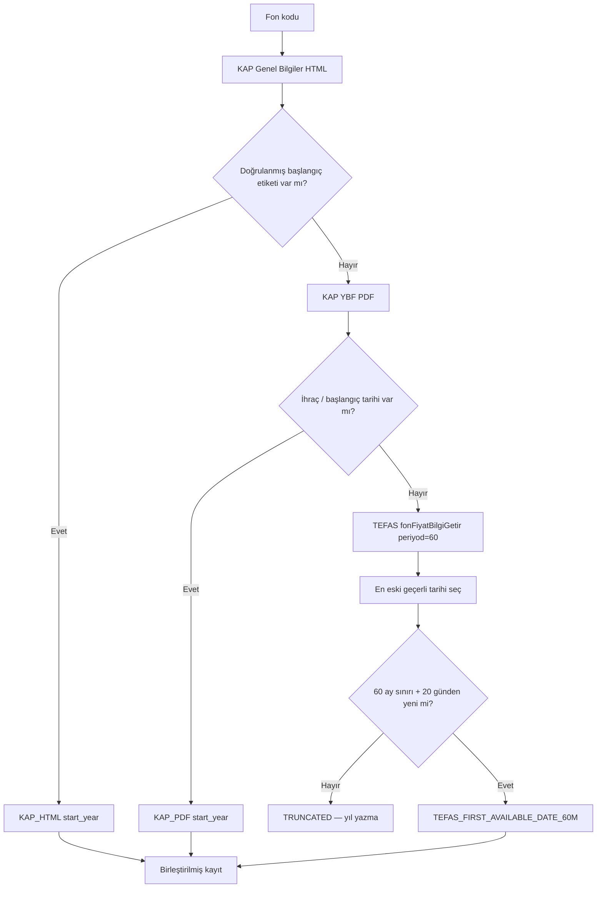

### KAP Başlangıç Etiketleri

Parser aşağıdaki doğrulanmış etiket ailesini ve normalleştirilmiş türevlerini destekler:

- `Fonun Halka Arz Tarihi`
- `Fon Halka Arz Tarihi`
- `Halka Arz Tarihi`
- `Fonun Halka Arza Başlama Tarihi`
- `Fonun Satış Başlangıç Tarihi`
- `Fon Paylarının Satış Başlangıç Tarihi`
- `Payların Satış Başlangıç Tarihi`
- `İlk Satış Tarihi`
- `Satış Başlangıç Tarihi`
- `Fonun Kuruluş Tarihi`
- `Kuruluş Tarihi`
- `Fonun Başlangıç Tarihi`
- `Başlangıç Tarihi`
- `Fonun İlk İhraç Tarihi`
- `İlk İhraç Tarihi`
- `İhraç Tarihi`
- İngilizce karşılıklar: `Public Offering Date`, `Inception Date`, `Issue Date` vb.

Belge tarihi, rapor tarihi, güncelleme tarihi, dönem tarihi ve fiyat tarihi başlangıç tarihi olarak kullanılmaz.

### TEFAS 60 Aylık Kuralı

Endpoint:

```text
POST https://www.tefas.gov.tr/api/funds/fonFiyatBilgiGetir
```

Örnek payload:

```json
{"fonKodu":"IV7","dil":"TR","periyod":60}
```

Kesin kurallar:

- `resultList` içindeki en eski geçerli tarih esas alınır.
- İlk fiyat `0` olabilir; tarih geçerliliğini etkilemez.
- Fiyat yalnız teşhis amacıyla saklanır.
- En eski tarih 60 aylık doğal sınırın 20 gün çevresindeyse seri kırpılmış kabul edilir.
- Fon başına aynı çalışma içinde yalnız bir başlangıç POST’u gönderilir.

---

## 6. Risk Seviyesi

### Nihai Risk Kaynak Sırası

```text
1. KAP Genel Bilgiler HTML
2. KAP Yatırımcı Bilgi Formu PDF
3. TEFAS toplu fonGetiriBazliBilgiGetir.riskDegeri
4. TEFAS tekil fonProfilBilgiGetir.riskDegeri
5. Kaynakların tümü boşsa risk_level boş
```

### Doğrudan TEFAS Risk Formülü

Yalnız aşağıdaki doğrulanmış alan isimleri okunur:

```text
riskDegeri
RiskDegeri
riskValue
```

Kabul edilen değerler:

```text
1, 2, 3, 4, 5, 6, 7
1/7 ... 7/7
```

Reddedilen değerler:

```text
null
boş metin
-
0
8 ve üzeri
rastgele başka bir 1–7 sayısı
```

### Risk Karar Akışı

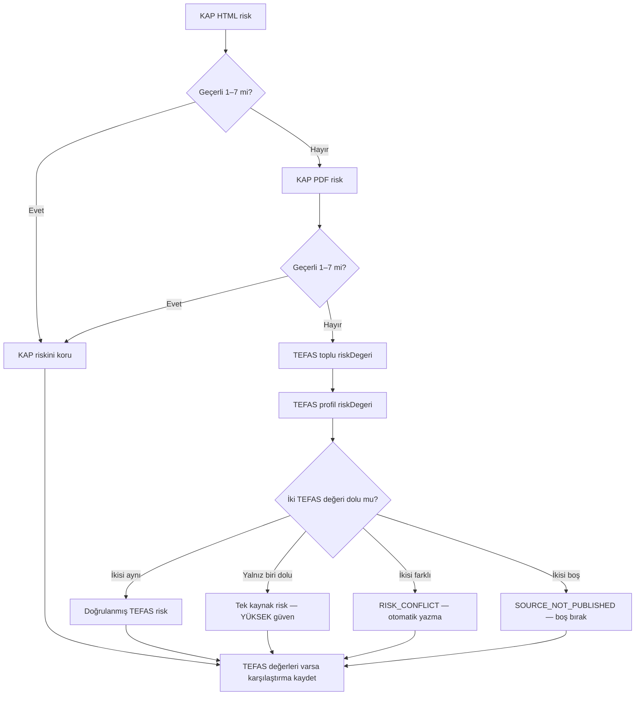

### KAP Risk Ayrıştırma Kuralları

1. `Yatırım Stratejisi` sütununun sağındaki `Risk Değeri` başlığı bulunur.
2. `rowspan` ve `colspan` hesaba katılarak görsel tablo ızgarası oluşturulur.
3. Aynı sütunun altındaki yalnız `1–7` değerleri okunur.
4. Birden fazla doğrulanmış risk varsa tüm değerler saklanır, ana değer en yüksek risk olur.
5. `TL`, `USD`, `EUR`, pay grubu, yüzde, ondalık ve `T+2` gibi bağlamlar risk değildir.

### TLY Doğrulama Örneği

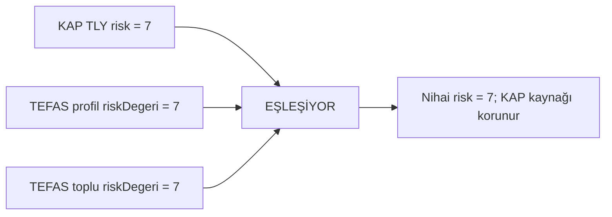

### Risk Yayımlanmıyorsa

BCK ve test edilen diğer birçok fonda profil ve toplu JSON satırında `riskDegeri` alanı mevcut olup değer `null` gelmiştir. Bu bir parser hatası değildir. Sistem:

- risk tahmin etmez,
- fon türünden risk üretmez,
- getiri oynaklığından risk hesaplamaz,
- herhangi bir `1–7` rakamını risk kabul etmez.

---

## 7. İşlem Durumu

### Birincil Model

TEFAS profil JSON’daki `tefasDurum`, nihai TEFAS işlem durumu kaynağıdır. `getFplFonList` doğrulama kaynağıdır. KAP sonucu kanıt ve çatışma kaydı olarak korunur.

### Normalizasyon

```text
AKTİF                     → AÇIK
PASİF                     → KAPALI
TEFAS'ta işlem görüyor    → AÇIK
TEFAS'ta işlem görmüyor   → KAPALI
true / 1                  → AÇIK
false / 0                 → KAPALI
```

Türkçe büyük `İ`, Unicode’da birleşik nokta karakterine dönüşse bile `AKTİF` doğru şekilde `AÇIK` olarak normalleştirilir.

### İşlem Durumu Karar Akışı

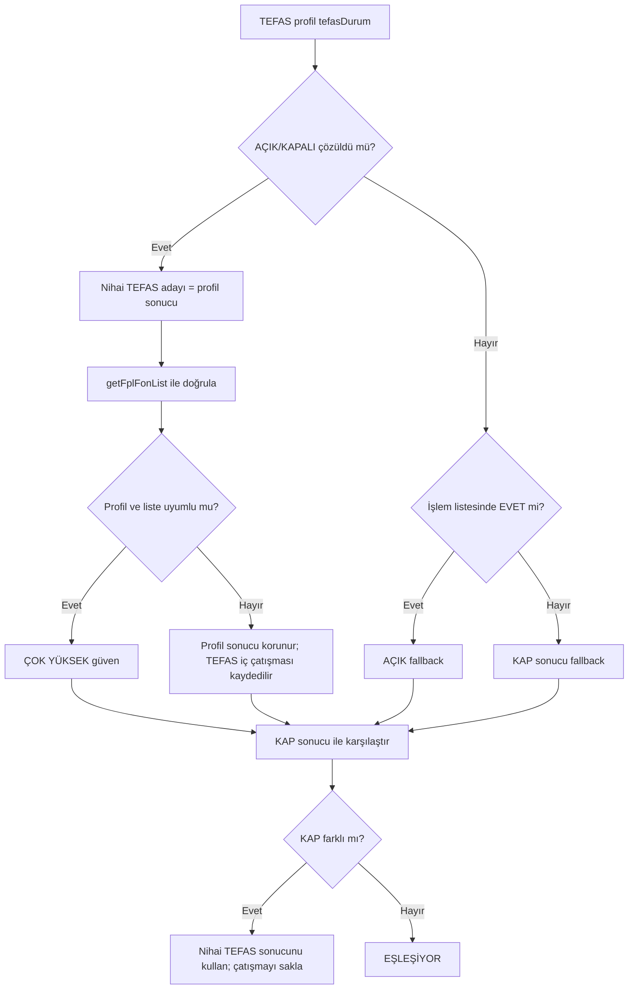

### BCK / DKC Doğrulama Örneği

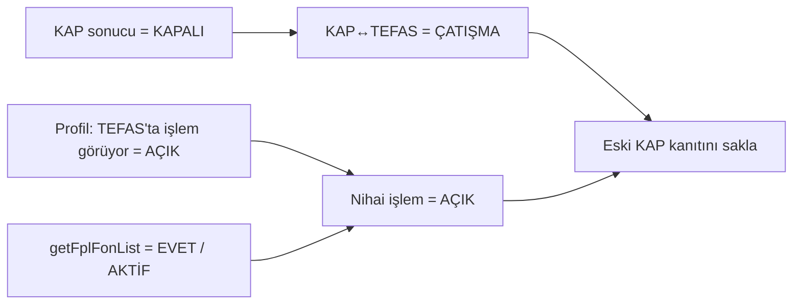

Kaydedilen yapı:

```text
transaction_status          = AÇIK
trade_status                = AÇIK
kap_transaction_status      = KAPALI
kap_tefas_status_comparison = ÇATIŞMA
transaction_conflict_flag   = EVET
transaction_source          = TEFAS_PROFILE:tefasDurum + TEFAS:getFplFonList
```

---

## 8. Mevcut Kayıtları Koruma ve Şema Migrasyonu

v9.6 mevcut 2.138 checkpoint kaydını sıfırlamaz.

- Eski v9.5 satırları yeni alanlar eksik olsa bile yüklenir.
- Yeni alanlara yalnız güvenli varsayılanlar eklenir.
- Eski `transaction_status`, ilk migrasyonda `kap_transaction_status` kanıtı olarak korunur.
- Geçerli KAP risk değeri TEFAS fallback ile ezilmez.
- Geçici HTTP/WAF/ağ hatası eski doğrulanmış KAP verisini silmez.
- TEFAS profil sonucu başarılıysa KAP taraması o batch’te hata verse bile mevcut kayıt üzerine profil zenginleştirmesi uygulanabilir.

### Migrasyon Akışı

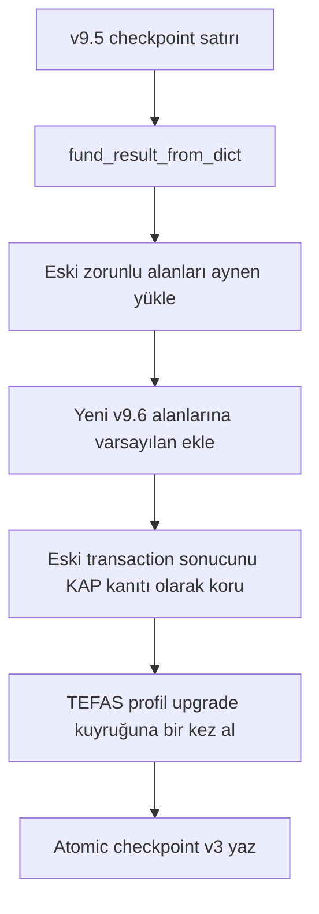

### Birleştirme Koruması

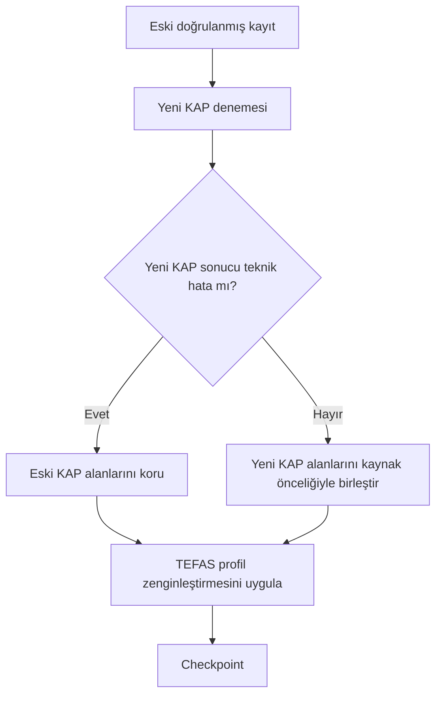

---

## 9. Batch ve Retry Kuyruğu

Öncelik sırası:

```text
1. Henüz hiç işlenmemiş fonlar
2. Teknik KAP hataları
3. TEFAS profil retry kayıtları
4. Eski checkpoint için TEFAS profil upgrade kayıtları
5. TEFAS başlangıç retry kayıtları
6. Eksik alan retry kayıtları
7. Eski parser upgrade kayıtları
8. Süresi dolmuş stale kayıtlar
```

### Kuyruk Akışı

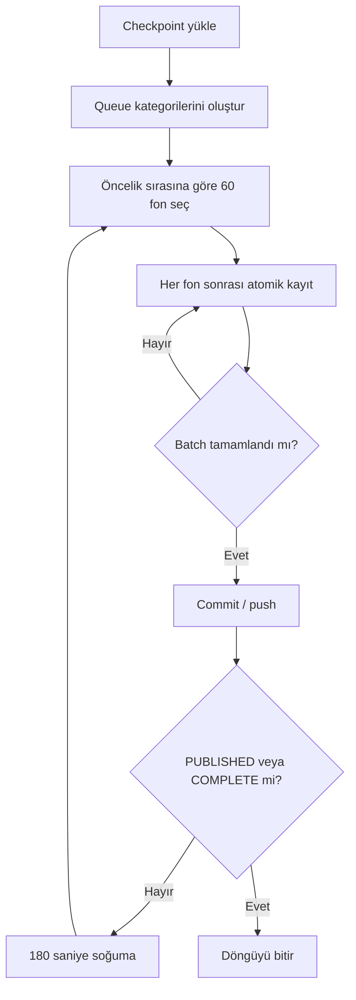

---

## 10. Hız ve Kilitlenme Koruması

- KAP istekleri arasında minimum `1.35` saniye.
- Kalıcı batch boyutu varsayılan `60` fon.
- TEFAS profil ve TEFAS başlangıç POST’ları aynı rate limiter sırasını paylaşır.
- TEFAS fon-bazlı POST istekleri arasında rastgele `15–20 saniye` bulunur.
- TEFAS profil için fon başına bir POST yapılır; aynı denemede otomatik tekrar yapılmaz.
- Teknik profil hataları sonraki batch/run içinde en fazla `3` deneme alır.
- TEFAS toplu risk endpoint’i batch başında yalnız bir kez çağrılır.
- WAF reddinde aynı batch içindeki sonraki fon-bazlı TEFAS POST’ları susturulur; KAP ve checkpoint çalışması korunur.
- Workflow varsayılan `max_batches=15` kullanır. Bu değer 6 saatlik GitHub süre sınırı içinde 15–20 saniyelik profil korumasına uygun seçilmiştir.
- `concurrency` kilidi aynı workflow’un eşzamanlı çalışmasını engeller.

### Rate Limit Akışı

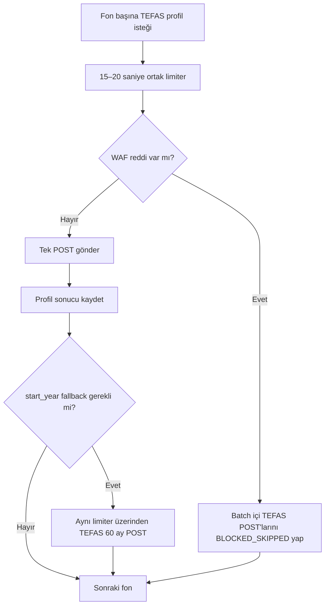

---

## 11. Kalıcı Dosyalar

```text
data/yat_fund_enrichment.json                    # Resmî yayın
data/run_state.json                              # Çalışma durumu
data/staging/yat_kap_progress.json               # Kalıcı checkpoint
data/staging/failed_codes.json                   # Retry kodları
data/diagnostics/request_failures.json           # Hata ve eksik alan teşhisi
data/diagnostics/attempt_events.jsonl             # Genel deneme geçmişi
data/diagnostics/pdf_fallback_events.jsonl        # PDF fallback geçmişi
data/diagnostics/tefas_start_year_events.jsonl    # TEFAS başlangıç geçmişi
data/diagnostics/tefas_profile_events.jsonl       # Profil/risk/trade doğrulama geçmişi
```

GitHub artifact içinde ayrıca:

```text
.run_output/KAP_YAT_SOURCE/TEFAS_PROFIL_JSON/
.run_output/KAP_YAT_SOURCE/TEFAS_TOPLU_RISK/
.run_output/KAP_YAT_SOURCE/HAM_SAYFALAR/
.run_output/KAP_YAT_SOURCE/HAM_BELGELER/
```

### Dosya Mimarisi

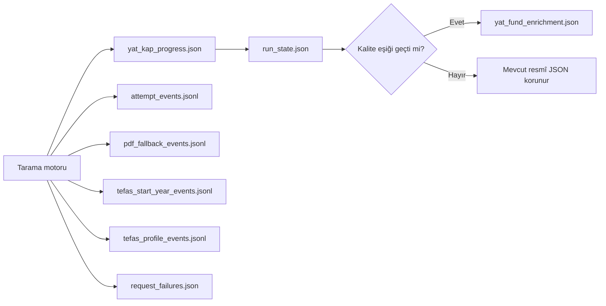

---

## 12. Yayın Kalite Eşikleri

Resmî JSON yalnız şu şartlarla güncellenir:

- KAP aktif YF/Y fon sayısı en az `2.000`.
- Ana evren kapsamı `%100`.
- Doğrulanmış KAP sayfa oranı en az `%98`.
- AÇIK/KAPALI nihai işlem durumu oranı en az `%98`.
- TEFAS profil kontrol oranı en az `%98`.
- Bekleyen retry/upgrade/stale kuyruğu `0`.

Eksik risk alanı tek başına yayın engeli değildir; kaynak risk yayımlamıyorsa `SOURCE_NOT_PUBLISHED` olarak boş kalabilir.

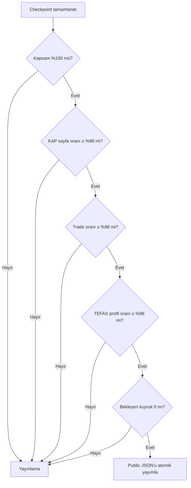

---

## 13. GitHub’a Uygulama

Repository köküne aynı klasör yapısıyla şu dosyaları yükleyip değiştirin:

```text
.github/workflows/update-yat-kap-data.yml
scripts/kap_yat_source.py
scripts/update_yat_kap_data.py
scripts/tefas_profile_source.py
scripts/tefas_start_year_source.py
tests/test_parser.py
README.md
CHANGES_v2.6_v9.6.md
VALIDATION.md
UPLOAD_AND_RUN.txt
FINAL_GITHUB_KURULUM.txt
YEREL_TAM_TEST_BASLAT.bat
YEREL_CALISTIRMA_NOTU.txt
```

**`data/` klasörünü silmeyin veya eski bir paketle ezmeyin.** v9.6 kodu mevcut checkpoint’i kendisi migrate eder.

### Uygulama Diyagramı

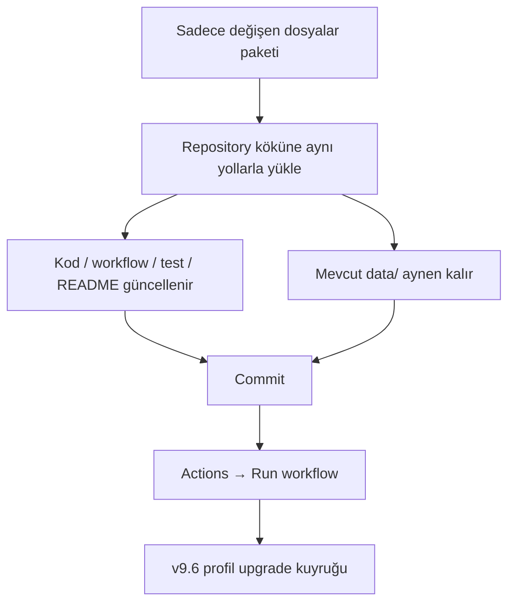

### Önerilen İlk Çalıştırma Ayarları

```text
batch_size                  = 60
max_batches                 = 15
cooldown_seconds            = 180
delay_seconds               = 1.35
tefas_start_delay_min       = 15
tefas_start_delay_max       = 20
max_tefas_profile_attempts  = 3
```

Alan adları `tefas_start_delay_*` olarak geriye dönük uyumluluk için korunmuştur; v9.6’da aynı limiter hem profil hem başlangıç POST’larını yönetir.

---

## 14. Workflow Durumları

- `IN_PROGRESS`: Bekleyen batch, profil upgrade veya retry var.
- `PUBLISHED`: Resmî JSON kalite eşiğini geçti ve güncellendi.
- `COMPLETE_WITH_UNRESOLVED`: Retry sınırı dolmuş kaynak problemleri var.

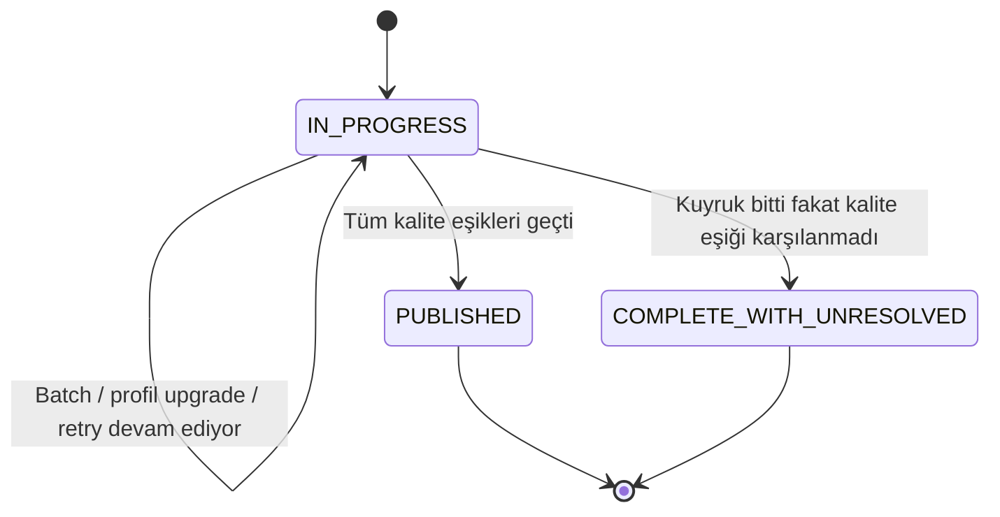

---

## 15. Public Adres

```text
https://raw.githubusercontent.com/GITHUB_KULLANICI_ADI/REPO_ADI/main/data/yat_fund_enrichment.json
```

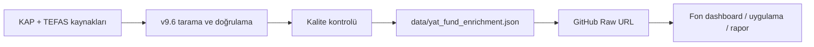

---

## 16. Windows Yerel Çalıştırma

`YEREL_TAM_TEST_BASLAT.bat`, GitHub workflow ile aynı `scripts/update_yat_kap_data.py` motorunu kullanır.

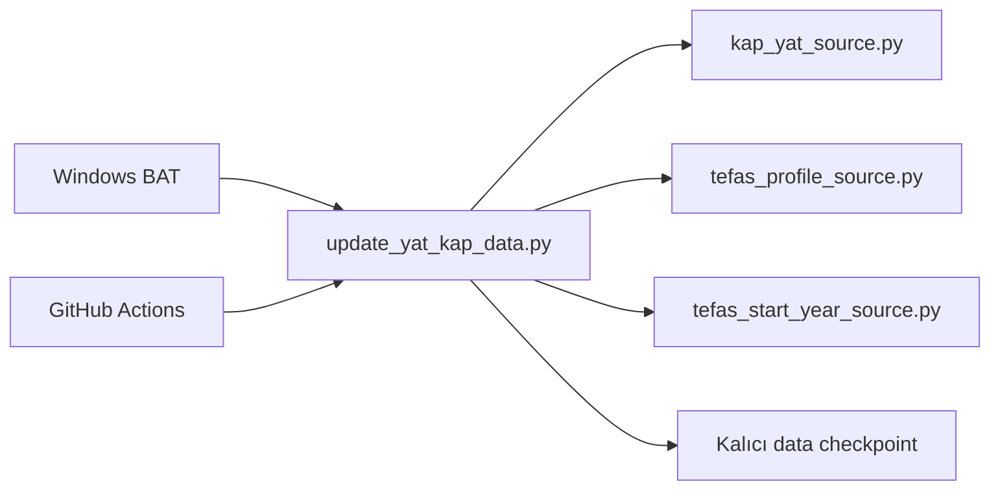

Yerel çalıştırma da mevcut `data/staging/yat_kap_progress.json` dosyasından devam eder. Playwright, OCR veya Tesseract üretim motorunun parçası değildir.
