# Piyasa Nabzı Türkiye — YAT/KAP Merkezi

Bu repository, **KAP aktif YF/Y yatırım fonu evrenini** v9.5 kurallarıyla tarar, eksik alanları kontrollü kaynak zinciriyle tamamlar, kalıcı checkpoint üzerinden kaldığı yerden devam eder ve kalite eşiği geçildiğinde public JSON veri beslemesi üretir.

## Büyük Resim — Veri Mimarisi

Sistem dört temel katmandan oluşur:

1. **Kaynak katmanı:** KAP aktif fon listesi, KAP Genel Bilgiler HTML, KAP Yatırımcı Bilgi Formu PDF ve yalnız gerekli olduğunda TEFAS JSON.
2. **Ayrıştırma ve doğrulama katmanı:** Fon adı, başlangıç yılı, risk seviyesi ve işlem durumu kuralları.
3. **Kalıcı çalışma katmanı:** Checkpoint, deneme sayıları, hata kayıtları ve fallback teşhisleri.
4. **Yayın katmanı:** Kalite kontrolü tamamlandıktan sonra güncellenen resmî JSON.

### Genel Akış Diyagramı

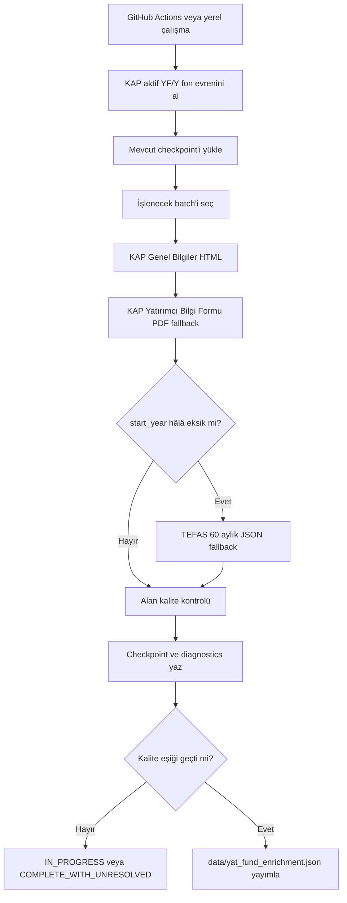

---

## Yayınlanan Ana Alanlar

Her fon için aşağıdaki ana alanlar yayımlanır:

| Alan | Anlamı | Birincil kaynak | Kontrollü yedek |
|---|---|---|---|
| `fund_name` | Resmî fon adı | KAP aktif YF/Y listesi | Mevcut doğrulanmış kayıt korunur |
| `start_year` | Fon başlangıç yılı | KAP HTML | KAP PDF → TEFAS 60 aylık JSON |
| `risk_level` | Risk seviyesi | KAP HTML | KAP PDF |
| `trade_status` | İşlem durumu | KAP Alım Satım Yerleri | Güncel TEFAS işlem doğrulaması |

Geriye dönük uyumluluk için `transaction_status`, `trade_status` ile aynı değeri taşır.

### Alan Veri Mimarisi

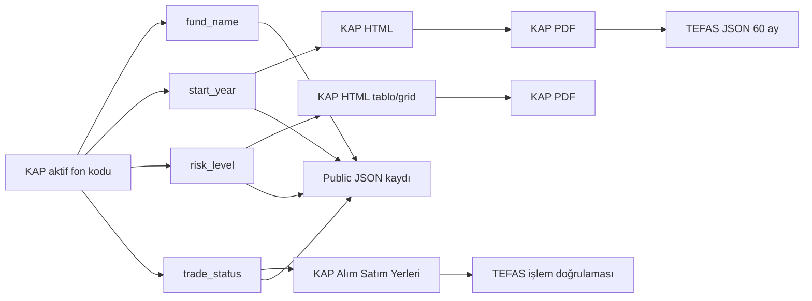

### Alan Yayın Akışı

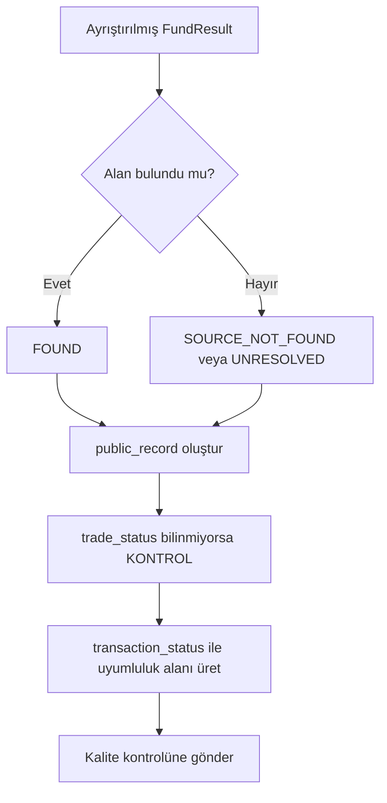

---

## v9.5 Kaynak Önceliği

Genel kaynak önceliği, resmî ve doğrudan kaynakların yedek kaynaklardan önce kullanılmasını sağlar.

### Genel Kaynak Mimarisi

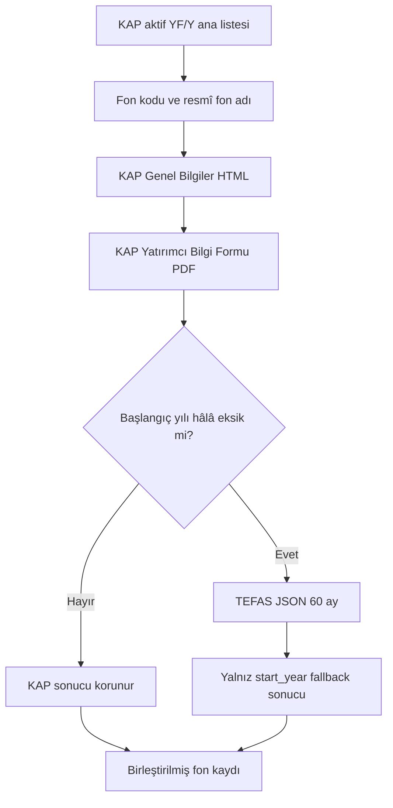

### Kaynak Üstünlüğü

```text
KAP aktif liste / KAP HTML
        >
KAP Yatırımcı Bilgi Formu PDF
        >
TEFAS 60 aylık JSON başlangıç yedeği
        >
Eksik bırakma; tahmin yapmama
```

---

### Fon Adı

#### Veri Mimarisi

Fon adı, KAP aktif `YF/Y` ana listesindeki resmî ad üzerinden alınır. Daha önce doğrulanmış dolu fon adı, geçici boş veya hatalı cevapla ezilmez.

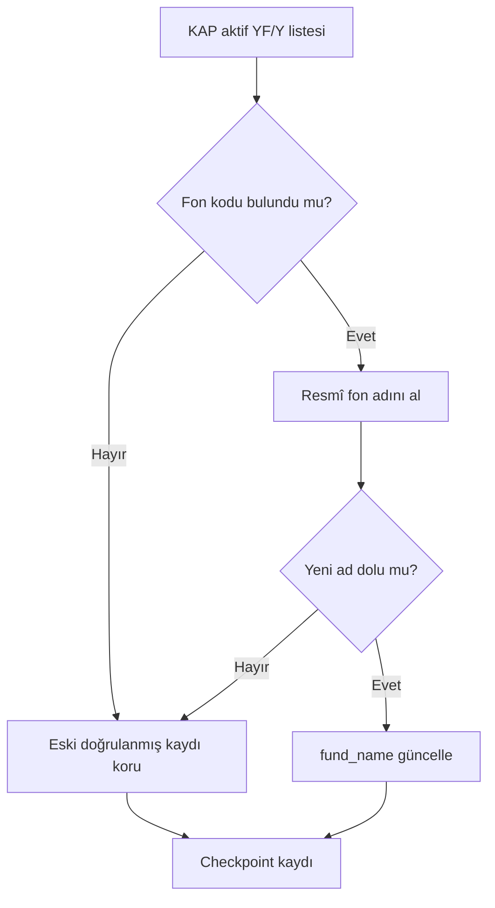

---

### Başlangıç Tarihi / Yılı

#### Veri Mimarisi

Başlangıç tarihi kaynak zinciri:

1. KAP **Genel Bilgiler** görünür HTML alanları.
2. KAP **Yatırımcı Bilgi Formu PDF**.
3. İlk iki kaynak sonuç üretmezse TEFAS **60 aylık JSON fiyat serisi**.
4. Hiçbir kaynak güvenilir sonuç üretmezse alan boş bırakılır; tahmin yapılmaz.

KAP HTML/PDF kaynakları her zaman TEFAS yedeğinden üstündür. Mevcut KAP başlangıç tarihi TEFAS verisiyle ezilmez.

#### Başlangıç Tarihi Akış Diyagramı

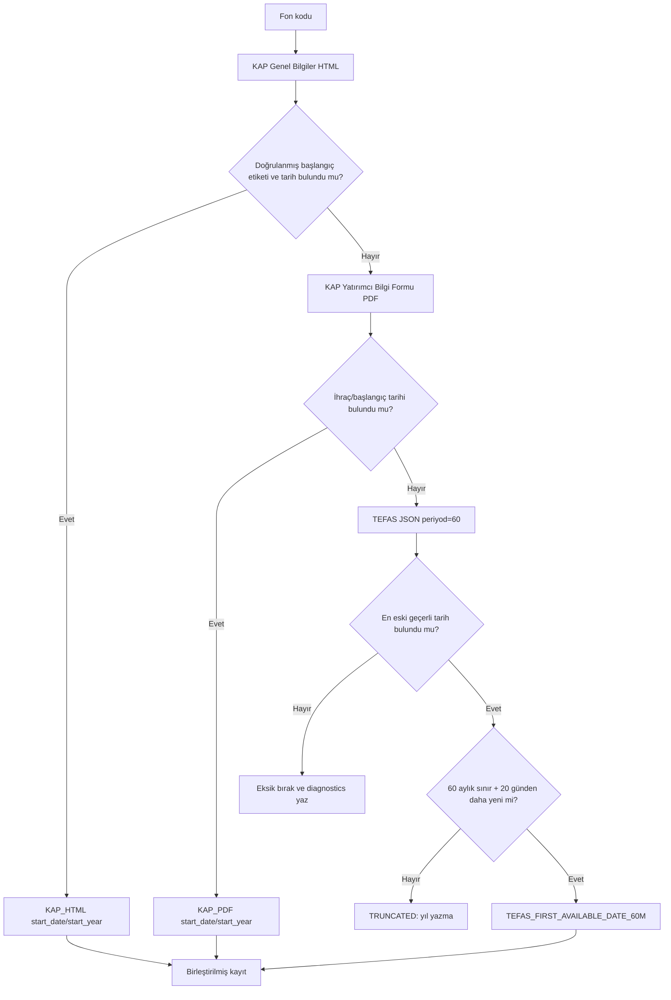

#### KAP Başlangıç Etiketi Ailesi

Parser tek bir ifadeye bağlı değildir. Aşağıdaki doğrulanmış etiket ailesi ve normalleştirilmiş türevleri korunur:

- `Fonun Halka Arz Tarihi`
- `Fon Halka Arz Tarihi`
- `Halka Arz Tarihi`
- `Fonun Halka Arza Başlama Tarihi`
- `Fonun Satış Başlangıç Tarihi`
- `Fon Paylarının Satış Başlangıç Tarihi`
- `Payların Satış Başlangıç Tarihi`
- `İlk Satış Tarihi`
- `Satış Başlangıç Tarihi`
- `Fonun Kuruluş Tarihi`
- `Kuruluş Tarihi`
- `Fonun Başlangıç Tarihi`
- `Başlangıç Tarihi`
- `Fonun İlk İhraç Tarihi`
- `İlk İhraç Tarihi`
- `İhraç Tarihi`
- İngilizce KAP karşılıkları (`Public Offering Date`, `Inception Date`, `Issue Date` vb.)

Büyük/küçük harf, Türkçe karakter, boşluk, satır sonu, `:` işareti ve HTML hücre ayrımı normalleştirilir. Belge tarihi, rapor tarihi, güncelleme tarihi ve fiyat tarihi gibi ilgisiz tarihler başlangıç tarihi olarak kullanılmaz.

#### Etiket Ayrıştırma Akışı

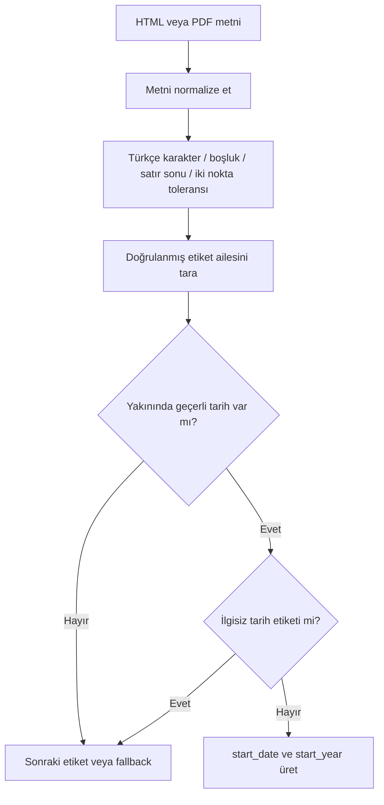

#### TEFAS 60 Aylık Başlangıç Yedeği

Endpoint:

```text
POST https://www.tefas.gov.tr/api/funds/fonFiyatBilgiGetir
```

Payload:

```json
{"fonKodu":"IV7","dil":"TR","periyod":60}
```

Kesin kurallar:

1. Endpoint yalnız KAP HTML ve KAP PDF başlangıç tarihi bulamadığında çağrılır.
2. Fon başına yalnız **bir POST isteği** gönderilir.
3. `resultList` içindeki **en eski geçerli tarih** esas alınır.
4. İlk kaydın fiyatı `0` olsa bile tarih geçerlidir.
5. Fiyat yalnız teşhis amacıyla saklanır; tarih kabulünü engellemez.
6. En eski tarih, bugünden 60 ay önceki doğal sınırın `20 gün` çevresindeyse seri kırpılmış kabul edilir ve başlangıç yılı yazılmaz.
7. Kaynak etiketi `TEFAS_FIRST_AVAILABLE_DATE_60M` olur.
8. TEFAS WAF/HTTP/ağ hatasında mevcut KAP kaydı korunur ve kontrollü retry kuyruğu kullanılır.
9. Bir batch içinde WAF reddi görülürse aynı batch'te yeni TEFAS başlangıç isteği gönderilmez.
10. TEFAS başlangıç istekleri arasında rastgele `15–20 saniye` beklenir.

#### TEFAS Veri Akışı

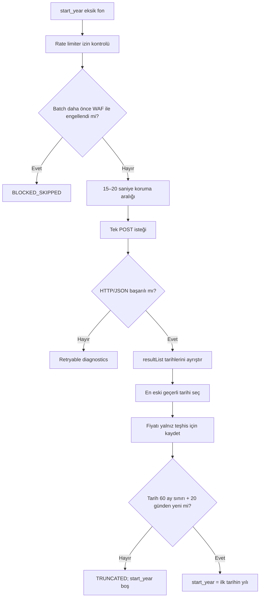

---

### Risk Seviyesi

#### Veri Mimarisi

Kaynak sırası:

1. KAP Genel Bilgiler görünür HTML.
2. Güvenilir sonuç yoksa KAP Yatırımcı Bilgi Formu PDF.

Çoklu risk değeri varsa tüm değerler korunur ve ana değer olarak en yüksek risk kullanılır.

#### Risk Ayrıştırma Akışı

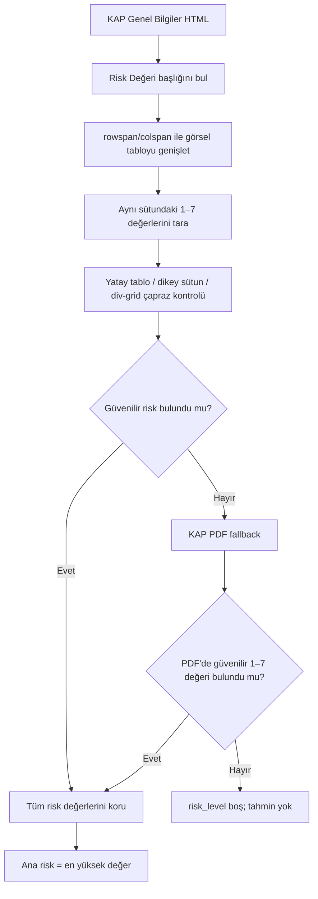

#### Risk Ayrıştırma Kuralları

1. `Yatırım Stratejisi` sütununun sağındaki `Risk Değeri` başlığı bulunur.
2. `rowspan`/`colspan` hesaba katılarak aynı sütunun alt satırındaki yalnız `1–7` değeri okunur.
3. Yatay tablo, dikey görsel sütun, div/grid, açık etiket ve sınırlandırılmış geniş bölüm yöntemleri çapraz kontrol edilir.
4. `TL`, `USD`, `EUR`, `A Grubu`, `B Grubu`, yüzde, ondalık ve `T+2` gibi yakın metinler risk adayı kabul edilmez.
5. Güvenilir sonuç yoksa alan boş (`—`) bırakılır; tahmin yapılmaz.

#### Yanlış Risk Adayı Engelleme Akışı

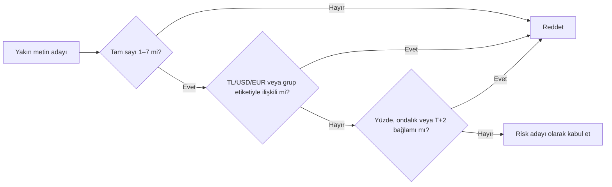

---

### İşlem Durumu

#### Veri Mimarisi

- KAP `Alım Satım Yerleri` alanı merkezlidir.
- Gerekli durumda güncel TEFAS işlem gören fon listesiyle doğrulanır.
- Boş alan, yalnız kurucu veya yalnız banka/portföy kanalları: `KAPALI`.
- Platformun tam adı/TEFDP veya doğrulanmış TEFAS erişimi: `AÇIK`.
- Teknik erişim ya da gerçek DOM ayrıştırma problemi: `KONTROL`/teşhis kuyruğu.

#### İşlem Durumu Akışı

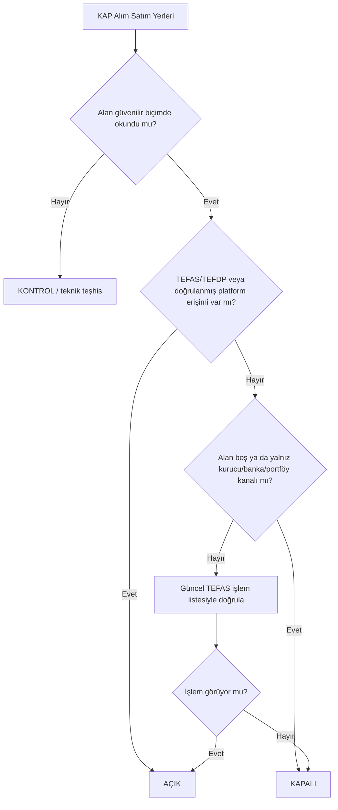

---

## Mevcut Kayıtları Koruma

v9.5 güncellemesi mevcut checkpoint ve resmî JSON'u sıfırlamaz.

- `data/staging/yat_kap_progress.json` aynen korunur.
- `data/yat_fund_enrichment.json` kalite eşiği geçilmeden değiştirilmez.
- Dolu ve doğrulanmış alan, yeni boş değerle ezilmez.
- KAP başlangıç tarihi, TEFAS başlangıç tarihiyle ezilmez.
- Geçici HTTP/WAF/ağ hatası daha önce doğrulanmış kaydın üzerine yazılmaz.
- Eski v9.4 parser ile eksik kalmış kayıtlar, deneme sayısı `3` veya daha yüksek olsa bile v9.5 motorunda **bir kez parser-upgrade kuyruğuna** alınır.
- v9.5 ile başarıyla işlenen kayıt aynı upgrade kuyruğuna tekrar girmez.

Bu nedenle GitHub workflow mevcut kayıtların kaldığı yerden devam eder; tüm fonları sıfırdan taramaz.

### Kayıt Koruma Mimarisi

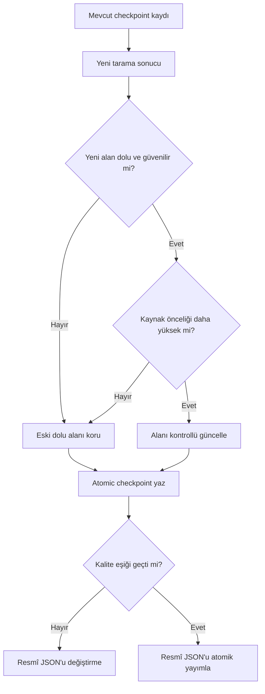

### Kaldığı Yerden Devam Akışı

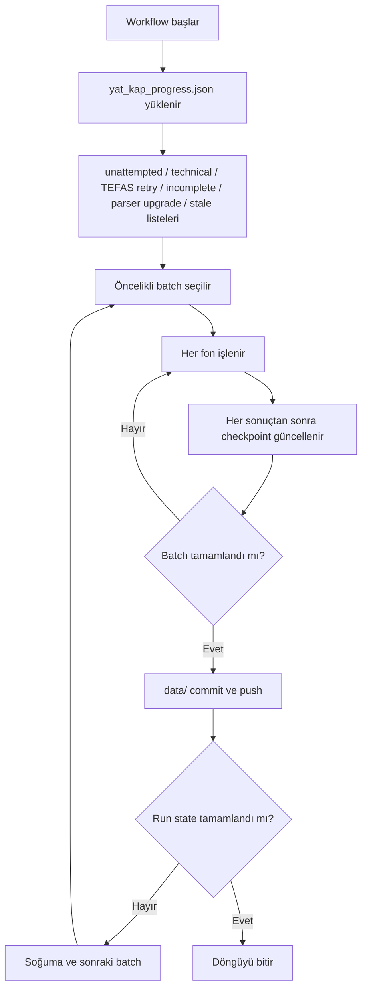

---

## Hız ve Kilitlenme Koruması

- Varsayılan 1 işçi mantığı.
- KAP istekleri arasında minimum `1.35` saniye.
- Workflow 60 fonluk kalıcı batch'ler hâlinde çalışır.
- Her batch sonrasında staging ve diagnostics dosyaları GitHub'a commit edilir.
- Batch'ler arasında varsayılan 180 saniye soğuma vardır.
- HTTP 429 oluşursa KAP motoru 3 → 10 → 20 dakika kademeli bekler ve aynı noktadan devam eder.
- TEFAS başlangıç JSON istekleri arasında rastgele 15–20 saniye bulunur.
- TEFAS WAF reddinde aynı batch içindeki sonraki TEFAS başlangıç istekleri durdurulur; KAP taraması ve checkpoint kaydı korunur.
- GitHub `concurrency` kilidi aynı veri güncelleme workflow'unun eşzamanlı çalışmasını engeller.

### Koruma Akış Diyagramı

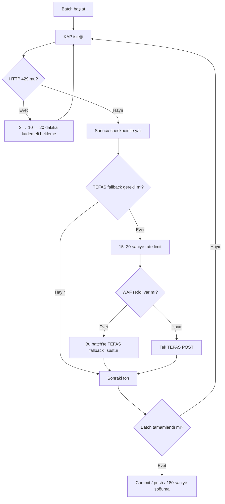

---

## Kalıcı Dosyalar

```text
data/yat_fund_enrichment.json                   # Resmî yayın; kalite eşiği geçince güncellenir
data/run_state.json                             # Çalışmanın mevcut durumu
data/staging/yat_kap_progress.json              # Her başarılı/başarısız denemenin checkpoint'i
data/staging/failed_codes.json                  # Yeniden denenecek kodlar
data/diagnostics/request_failures.json          # Hata kategorileri ve ayrıntılar
data/diagnostics/attempt_events.jsonl            # Genel deneme geçmişi
data/diagnostics/pdf_fallback_events.jsonl       # KAP PDF fallback geçmişi
data/diagnostics/tefas_start_year_events.jsonl   # TEFAS başlangıç fallback geçmişi
```

`yat_fund_enrichment.json`, tarama yarımken veya kalite eşiği geçilmemişken değiştirilmez. Staging ve diagnostics her batch sonunda repoda kalıcı hâle gelir.

### Dosya Veri Mimarisi

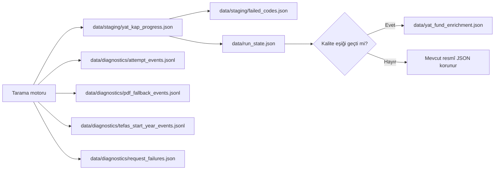

### Dosya Yazma Akışı

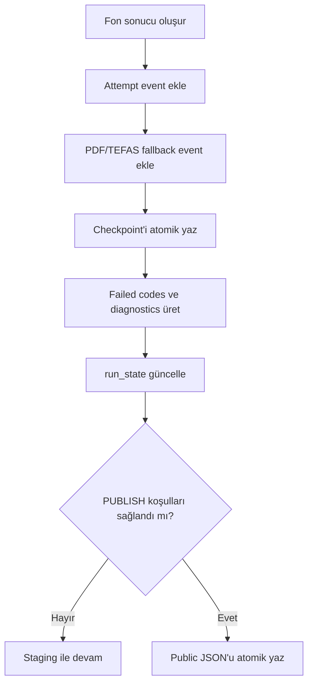

---

## v9.5 Güncellemesini Mevcut Repoya Uygulama

Yalnız değişen/yeni dosyaları repository köküne aynı klasör yapısıyla yükleyin:

```text
.github/workflows/update-yat-kap-data.yml
scripts/kap_yat_source.py
scripts/update_yat_kap_data.py
scripts/tefas_start_year_source.py
tests/test_parser.py
README.md
CHANGES_v2.5_v9.5.md
```

**`data/` klasörünü silmeyin, değiştirmeyin veya eski paketle ezmeyin.** Böylece mevcut checkpoint korunur.

### Güncelleme Mimarisi

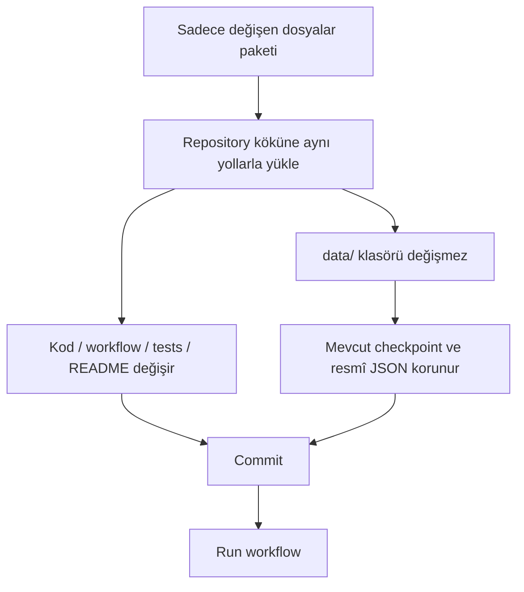

### Uygulama Akışı

1. GitHub'da değişen dosyaları commit edin.
2. `Actions > YAT KAP Merkezi Veri Güncelleme > Run workflow` yolunu açın.
3. İlk çalıştırmada varsayılanları koruyun:
   - `batch_size: 60`
   - `max_batches: 40`
   - `cooldown_seconds: 180`
   - `delay_seconds: 1.35`
   - `tefas_start_delay_min: 15`
   - `tefas_start_delay_max: 20`
4. Workflow mevcut checkpoint'i okuyup eski parser ile eksik kalmış kayıtları öncelikli upgrade kuyruğuna alır.
5. Her batch GitHub'a ayrıca commit edilir; yarıda kalsa sonraki çalışma kaldığı yerden devam eder.

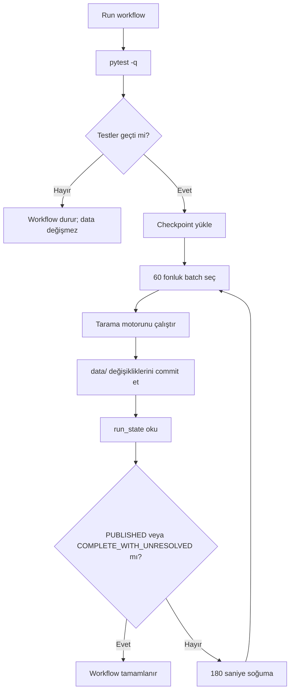

---

## Durumlar

- `IN_PROGRESS`: Kaldığı yerden devam edecek kayıtlar var.
- `PUBLISHED`: Resmî JSON kalite eşiğini geçti ve güncellendi.
- `COMPLETE_WITH_UNRESOLVED`: Kontrollü tekrar sınırı dolmuş birkaç kaynak problemi kaldı; diagnostics incelenmelidir.

### Durum Akış Diyagramı

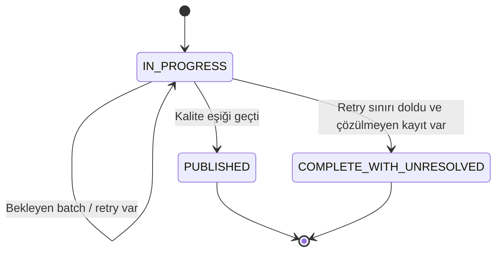

---

## Public Adres

```text
https://raw.githubusercontent.com/GITHUB_KULLANICI_ADI/REPO_ADI/main/data/yat_fund_enrichment.json
```

### Public Veri Akışı

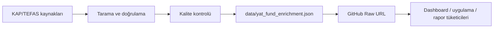

Public URL yalnız `PUBLISHED` durumunda güncellenen resmî JSON'u sunar. Staging ve diagnostics dosyaları public veri sözleşmesinin parçası değildir.

---

## Windows Yerel Tam Tarama

`YEREL_TAM_TEST_BASLAT.bat`, GitHub ile aynı `scripts/update_yat_kap_data.py` motorunu kullanır. Mevcut data checkpoint'i korunarak devam eder. Eski bağımsız Playwright/Tesseract test paketleri ana repoya eklenmemelidir.

### Yerel Çalışma Mimarisi

```mermaid
flowchart TD
    A["YEREL_TAM_TEST_BASLAT.bat"] --> B["scripts/update_yat_kap_data.py"]
    B --> C["Aynı parser ve fallback kuralları"]
    C --> D["Mevcut data/staging checkpoint"]
    D --> E["Yerel batch taraması"]
    E --> F["Aynı run_state / diagnostics / public kalite kuralları"]
```

### Yerel ve GitHub Motor Uyumu

```mermaid
flowchart LR
    A["Windows yerel BAT"] --> C["update_yat_kap_data.py"]
    B["GitHub Actions workflow"] --> C
    C --> D["kap_yat_source.py"]
    C --> E["tefas_start_year_source.py"]
    C --> F["Kalıcı data dosyaları"]
```

Bu yapı sayesinde yerel testte doğrulanan kural ile GitHub workflow'da çalışan kural aynı kalır.
