# Piyasa Nabzı Türkiye — YAT/KAP Merkezi

Bu repository, **KAP aktif YF/Y yatırım fonu evrenini** v9.6 kaynak kurallarıyla tarar; fon adı, başlangıç yılı, risk seviyesi ve işlem durumunu resmî kaynak zinciriyle doğrular; kalıcı checkpoint üzerinden kaldığı yerden devam eder ve kalite eşiği geçildiğinde public JSON üretir.

**Publisher v2.7 optimizasyonu**, v2.6'da oluşan gereksiz tam-liste yeniden taramasını kaldırır:

- Mevcut doğrulanmış KAP kayıtları yalnız yeni profil alanı yok diye tekrar kuyruğa alınmaz.
- TEFAS toplu `riskDegeri` ve toplu `tefasDurum` tek istekte alınır.
- `getFplFonList` tek istekte alınır.
- Toplu durum ile canlı liste uyumluysa tekil profil isteği yapılmaz.
- Tekil `fonProfilBilgiGetir` yalnız belirsiz, çelişkili veya tüm risk kaynakları boş kalan seçili kayıtlarda çağrılır.
- KAP detay sayfası yalnız eski KAP kuyruğunda bulunan eksik, hatalı, parser-upgrade veya stale kayıtlar için yeniden açılır.

Doğrulanmış kaynaklar:

- `POST /api/funds/fonProfilBilgiGetir`
  - `riskDegeri`
  - `tefasDurum`
  - `isinKodu`
  - `kapLink`
- `POST /api/funds/fonGetiriBazliBilgiGetir`
  - toplu `riskDegeri`
  - toplu `tefasDurum`
- `POST /api/statistics/tefas/getFplFonList`
  - canlı işlem gören fon listesi

TLY, BCK ve DKC testlerinde:

- TLY: KAP risk `7` = TEFAS profil risk `7` = TEFAS toplu risk `7`.
- BCK ve DKC: KAP sonucu `KAPALI`; TEFAS profil `AÇIK`; canlı işlem listesi `EVET`. Nihai işlem durumu `AÇIK` kabul edilir ve çatışma saklanır.
- TEFAS `riskDegeri` bazı fonlarda gerçekten `null` olabilir. Risk uydurulmaz.

---

## 1. Büyük Resim — Veri Mimarisi

Sistem beş katmandan oluşur:

1. **Evren katmanı:** KAP aktif YF/Y fon listesi.
2. **Toplu TEFAS katmanı:** Tek toplu risk/durum isteği ve tek canlı işlem listesi isteği.
3. **KAP ayrıştırma katmanı:** Yalnız gerçek KAP kuyruğundaki fonlar için Genel Bilgiler HTML ve YBF PDF.
4. **Seçici profil katmanı:** Yalnız belirsiz/çelişkili kayıtlar için tekil TEFAS profil.
5. **Kalıcı yayın katmanı:** Checkpoint, diagnostics ve kalite kontrollü public JSON.

### Genel Akış Diyagramı

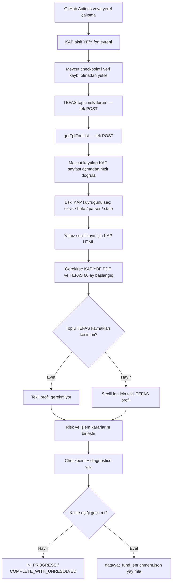

## 2. Yayınlanan Ana Alanlar

| Alan | Anlamı | Birincil kaynak | Kontrollü yedek |
|---|---|---|---|
| `fund_name` | Resmî fon adı | KAP aktif YF/Y listesi | Eski doğrulanmış kayıt |
| `start_year` | Fon başlangıç yılı | KAP HTML | KAP PDF → TEFAS 60 ay JSON |
| `risk_level` | Risk seviyesi 1–7 | KAP HTML | KAP PDF → TEFAS toplu → gerektiğinde TEFAS profil |
| `trade_status` | Nihai işlem durumu | Başarılı profil varsa profil; aksi halde uyumlu toplu durum + canlı liste | Kesin TEFAS kararı yoksa doğrulanmış KAP |
| `transaction_status` | Geriye dönük uyumluluk alanı | `trade_status` ile aynı | — |

### Kanıt Alanları

- `risk_source`, `risk_confidence`, `risk_conflict_flag`, `risk_tefas_comparison`
- `tefas_profile_risk_raw`, `tefas_bulk_risk_raw`
- `kap_transaction_status`, `kap_transaction_source`
- `kap_tefas_status_comparison`, `transaction_conflict_flag`
- `tefas_status_raw`, `tefas_status_normalized`
- `tefas_bulk_status_raw`, `tefas_bulk_status_normalized`
- `tefas_internal_conflict`
- `tefas_traded_list_match`, `tefas_traded_list_status`
- `tefas_profile_checked_at`, `tefas_profile_api_status`
- `tefas_profile_isin`, `tefas_profile_kap_link`

### Alan Veri Mimarisi

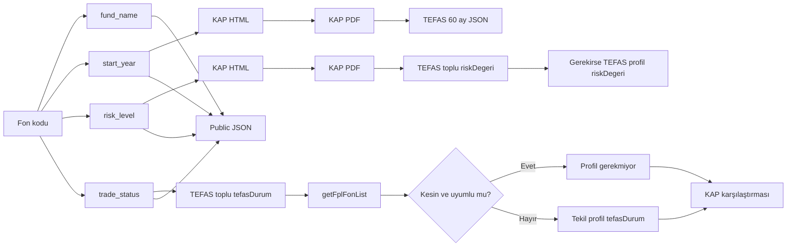

## 3. Kaynak Önceliği

### Genel Kaynak Sırası

```text
KAP aktif liste / KAP görünür HTML
        >
KAP Yatırımcı Bilgi Formu PDF
        >
TEFAS doğrulanmış toplu JSON alanları
        >
Yalnız gerekirse TEFAS tekil profil
        >
Eksik bırakma — tahmin yapmama
```

Geçerli KAP risk değeri TEFAS ile ezilmez. İşlem durumunda başarılı profil sonucu varsa profil önceliklidir. Profil gerekmiyorsa toplu `tefasDurum` ile canlı işlem listesi birlikte kullanılır. Bu iki kaynak belirsiz veya çelişkiliyse tekil profil çağrılır; profil de hata verirse mevcut doğrulanmış KAP değeri korunur ve karşılaştırma `KONTROL` olur.

### Kaynak Üstünlüğü Diyagramı

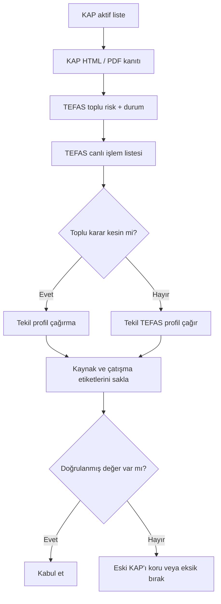

## 4. Fon Adı

Fon adı KAP aktif `YF/Y` ana listesindeki resmî addır. Profil JSON’daki ad teşhis amacıyla saklanabilir; KAP ana liste adı otomatik olarak profil adıyla ezilmez.

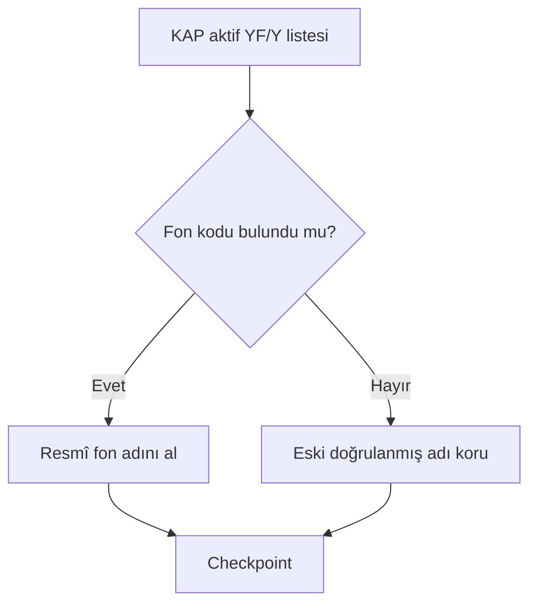

---

## 5. Başlangıç Tarihi / Yılı

### Kaynak Zinciri

1. KAP Genel Bilgiler görünür HTML.
2. KAP Yatırımcı Bilgi Formu PDF.
3. İlk iki kaynak sonuç üretmezse TEFAS 60 aylık fiyat JSON’u.
4. Hiçbir kaynak güvenilir sonuç üretmezse alan boş kalır.

### Başlangıç Akışı

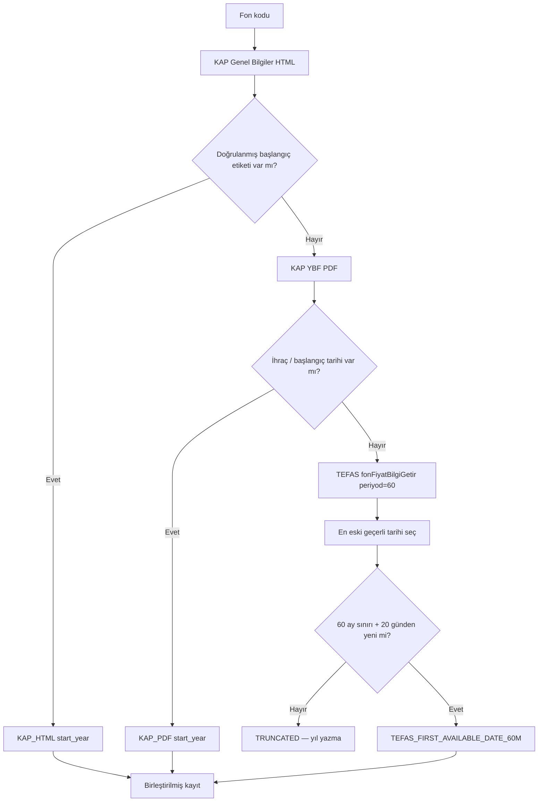

### KAP Başlangıç Etiketleri

Parser aşağıdaki doğrulanmış etiket ailesini ve normalleştirilmiş türevlerini destekler:

- `Fonun Halka Arz Tarihi`
- `Fon Halka Arz Tarihi`
- `Halka Arz Tarihi`
- `Fonun Halka Arza Başlama Tarihi`
- `Fonun Satış Başlangıç Tarihi`
- `Fon Paylarının Satış Başlangıç Tarihi`
- `Payların Satış Başlangıç Tarihi`
- `İlk Satış Tarihi`
- `Satış Başlangıç Tarihi`
- `Fonun Kuruluş Tarihi`
- `Kuruluş Tarihi`
- `Fonun Başlangıç Tarihi`
- `Başlangıç Tarihi`
- `Fonun İlk İhraç Tarihi`
- `İlk İhraç Tarihi`
- `İhraç Tarihi`
- İngilizce karşılıklar: `Public Offering Date`, `Inception Date`, `Issue Date` vb.

Belge tarihi, rapor tarihi, güncelleme tarihi, dönem tarihi ve fiyat tarihi başlangıç tarihi olarak kullanılmaz.

### TEFAS 60 Aylık Kuralı

Endpoint:

```text
POST https://www.tefas.gov.tr/api/funds/fonFiyatBilgiGetir
```

Örnek payload:

```json
{"fonKodu":"IV7","dil":"TR","periyod":60}
```

Kesin kurallar:

- `resultList` içindeki en eski geçerli tarih esas alınır.
- İlk fiyat `0` olabilir; tarih geçerliliğini etkilemez.
- Fiyat yalnız teşhis amacıyla saklanır.
- En eski tarih 60 aylık doğal sınırın 20 gün çevresindeyse seri kırpılmış kabul edilir.
- Fon başına aynı çalışma içinde yalnız bir başlangıç POST’u gönderilir.

---

## 6. Risk Seviyesi

### Nihai Risk Kaynak Sırası

```text
1. KAP Genel Bilgiler HTML
2. KAP Yatırımcı Bilgi Formu PDF
3. TEFAS toplu fonGetiriBazliBilgiGetir.riskDegeri
4. Yalnız gerekirse TEFAS tekil fonProfilBilgiGetir.riskDegeri
5. Kaynakların tümü boşsa risk_level boş
```

### Doğrudan TEFAS Risk Formülü

Yalnız aşağıdaki doğrulanmış alan isimleri okunur:

```text
riskDegeri
RiskDegeri
riskValue
```

`1–7` ve `n/7` kabul edilir. `null`, boş, `-`, `0`, `8+` veya bağlamsız başka sayılar reddedilir.

### Risk Karar Akışı

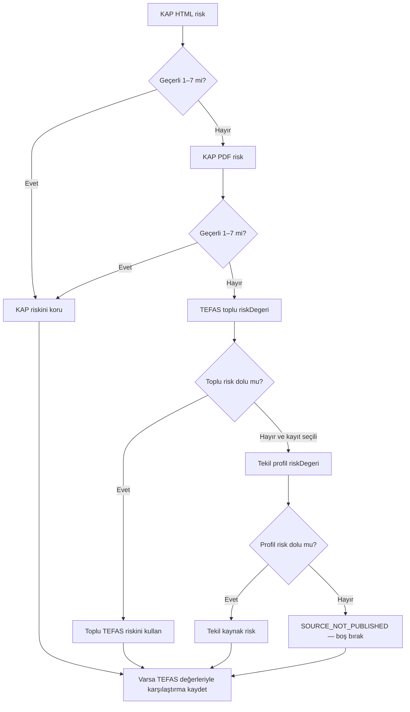

### KAP Risk Ayrıştırma Kuralları

1. `Yatırım Stratejisi` sütununun sağındaki `Risk Değeri` başlığı bulunur.
2. `rowspan` ve `colspan` hesaba katılır.
3. Aynı sütunun altındaki yalnız `1–7` değerleri okunur.
4. Birden fazla doğrulanmış risk varsa en yüksek değer ana risk olur.
5. `TL`, `USD`, `EUR`, pay grubu, yüzde, ondalık ve `T+2` risk değildir.

### TLY Doğrulama Örneği

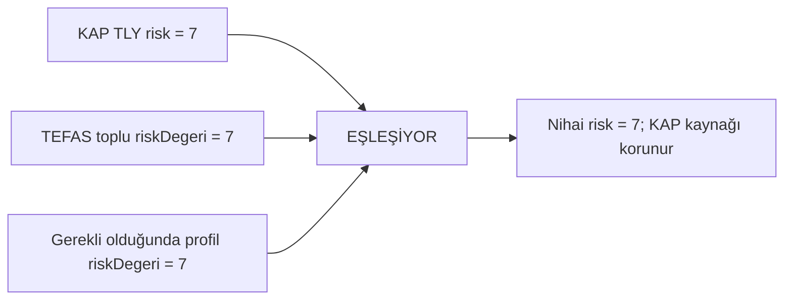

TEFAS risk yayımlamıyorsa sistem tahmin, fon türü veya oynaklık hesabı yapmaz; alan boş kalır.

## 7. İşlem Durumu

### Optimize Karar Modeli

1. Başarılı ve açık bir tekil profil sonucu zaten varsa profil `tefasDurum` birincildir.
2. Profil yoksa toplu `tefasDurum` ile `getFplFonList` birlikte değerlendirilir.
3. `AÇIK + EVET` veya `KAPALI + HAYIR` uyumu varsa profil isteği yapılmaz.
4. Toplu kaynaklar belirsiz veya çelişkiliyse yalnız o fon için profil çağrılır.
5. Profil `REQUEST_ERROR`, WAF veya benzeri teknik hata verirse mevcut doğrulanmış KAP değeri korunur; `KAP↔TEFAS KONTROL` yazılır.

### Normalizasyon

```text
AKTİF                     → AÇIK
PASİF                     → KAPALI
TEFAS'ta işlem görüyor    → AÇIK
TEFAS'ta işlem görmüyor   → KAPALI
true / 1                  → AÇIK
false / 0                 → KAPALI
```

### İşlem Durumu Karar Akışı

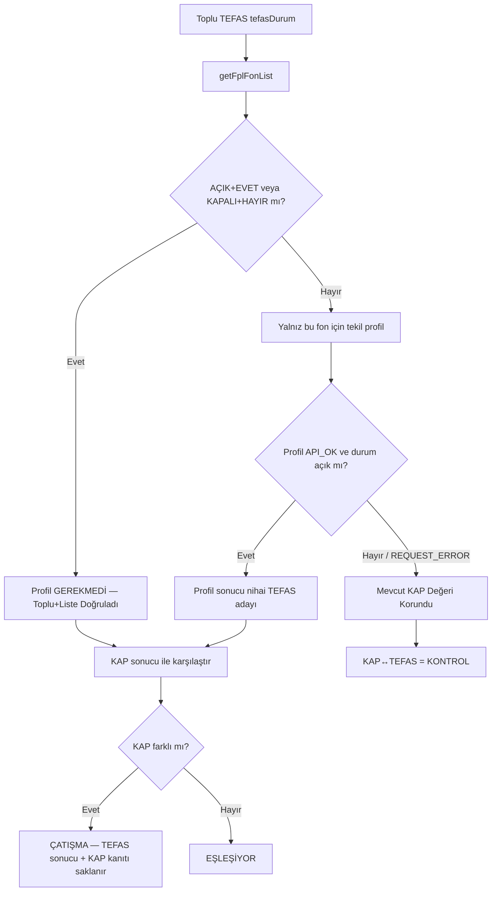

### Log Metinleri

```text
Profil GEREKMEDİ — Toplu+Liste Doğruladı
Profil API_OK/200
Profil REQUEST_ERROR — Mevcut KAP Değeri Korundu
Kayıt Durumu OK
```

`REQUEST_ERROR/—`, HTTP cevabı alınmadan oluşan geçici bağlantı/timeout türü hatadır. Bu durumda veri silinmez ve sahte `EŞLEŞİYOR` üretilmez.

### BCK / DKC Örneği

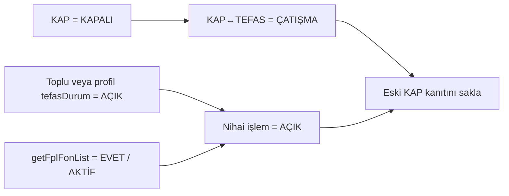

## 8. Mevcut Kayıtları Koruma ve Liste Farkı

Publisher v2.7 mevcut checkpoint kayıtlarını sıfırlamaz.

- Eski satırlar yeni alanlar eksik olsa bile yüklenir.
- Geçerli KAP adı, başlangıç yılı ve risk değeri korunur.
- Geçici HTTP/WAF/ağ hatası doğrulanmış alanları silmez.
- Toplu TEFAS hızlı geçişi, mevcut kayıtları KAP sayfasını yeniden açmadan zenginleştirir.
- Tekil profil yalnız gerekli kayıtta çalışır.

### `KAP YF/Y 2134 | Kayıtlı 2138` Ne Demektir?

`KAP YF/Y`, çalışmanın o anında KAP aktif YF/Y endpoint'inden dönen canlı sayıdır. `Kayıtlı`, checkpoint'te korunan tarihsel kayıt sayısıdır. Fark `4` ise dört kod checkpoint'te korunuyor fakat güncel aktif YF/Y listesinde bulunmuyor. Sistem bunları otomatik silmez.

v2.7 her çalışmada şu satırları yazdırır:

```text
Liste farkı: Yeni KAP kodu X | Checkpoint'te olup güncel aktif KAP listesinde olmayan Y
Güncel aktif listede olmayan korunan kodlar: KOD1, KOD2, ...
```

Aynı liste `data/run_state.json` içinde de saklanır:

```text
checkpoint_only_count
checkpoint_only_codes
new_kap_code_count
new_kap_codes
```

### Migrasyon Akışı

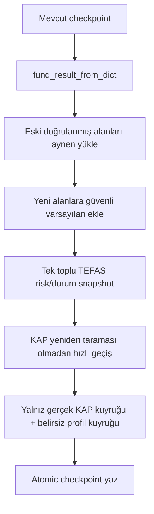

## 9. Batch ve Retry Kuyruğu

Öncelik sırası:

```text
1. Henüz hiç işlenmemiş fonlar
2. Teknik KAP hataları
3. TEFAS başlangıç retry kayıtları
4. Eksik alan retry kayıtları
5. Eski parser upgrade kayıtları
6. Yalnız gerçekten gerekli TEFAS profil retry kayıtları
7. Süresi dolmuş stale kayıtlar
```

**Eski checkpoint'in tamamı için profil-upgrade kuyruğu yoktur.**

### Kuyruk Akışı

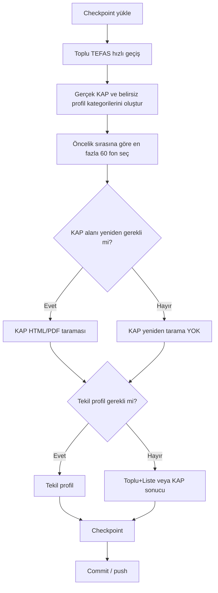

## 10. Hız ve Kilitlenme Koruması

- KAP gecikmesi eski değerle aynıdır: minimum `1.35` saniye.
- Batch boyutu eski değerle aynıdır: `60`.
- Workflow varsayılanı tekrar eski değerine alınmıştır: `max_batches=40`.
- Batch arası soğuma eski değerle aynıdır: `180` saniye.
- TEFAS 60 aylık başlangıç gecikmesi değişmemiştir: `15–20` saniye.
- Tekil profil artık her fon için değil, yalnız belirsiz/çelişkili kayıt için çağrılır.
- Profil ve başlangıç POST'ları **eşzamanlı değildir**; aynı limiter içinde sırayla çalışır.
- `TEFAS API koruma beklemesi: 13.3 saniye` yazması, gerçek aralığın 13.3 olduğu anlamına gelmez. Önceki TEFAS isteğinden sonra KAP işlemlerinde geçen süre düşülür; iki TEFAS isteğinin başlangıçları arasındaki toplam süre yine `15–20` saniyedir.
- TEFAS bulk ve profil çağrıları aynı `requests.Session` üzerinden yürütülür; her fonda yeni bağlantı açılmaz.
- Aynı workflow'un eşzamanlı ikinci kopyası `concurrency` ile engellenir.

### İstek Akışı

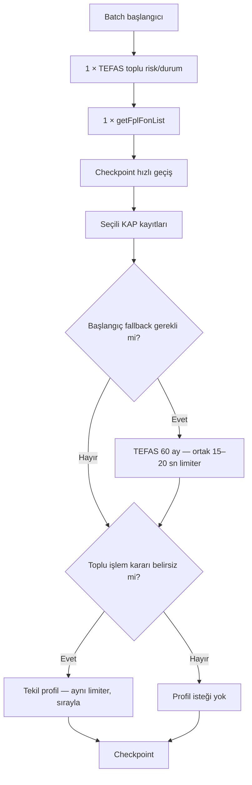

## 11. Kalıcı Dosyalar

```text
data/yat_fund_enrichment.json                    # Resmî yayın
data/run_state.json                              # Çalışma durumu
data/staging/yat_kap_progress.json               # Kalıcı checkpoint
data/staging/failed_codes.json                   # Retry kodları
data/diagnostics/request_failures.json           # Hata ve eksik alan teşhisi
data/diagnostics/attempt_events.jsonl             # Genel deneme geçmişi
data/diagnostics/pdf_fallback_events.jsonl        # PDF fallback geçmişi
data/diagnostics/tefas_start_year_events.jsonl    # TEFAS başlangıç geçmişi
data/diagnostics/tefas_profile_events.jsonl       # Profil/risk/trade doğrulama geçmişi
```

GitHub artifact içinde ayrıca:

```text
.run_output/KAP_YAT_SOURCE/TEFAS_PROFIL_JSON/
.run_output/KAP_YAT_SOURCE/TEFAS_TOPLU_RISK/
.run_output/KAP_YAT_SOURCE/HAM_SAYFALAR/
.run_output/KAP_YAT_SOURCE/HAM_BELGELER/
```

### Dosya Mimarisi

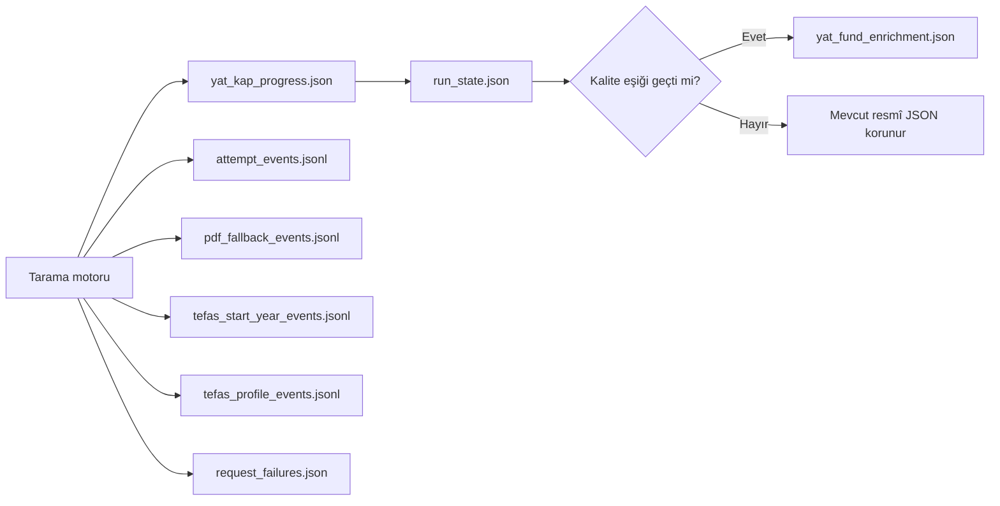

---

## 12. Yayın Kalite Eşikleri

Resmî JSON yalnız şu şartlarla güncellenir:

- KAP aktif YF/Y fon sayısı en az `2.000`.
- Ana evren kapsamı `%100`.
- Doğrulanmış KAP sayfa oranı en az `%98`.
- AÇIK/KAPALI nihai işlem durumu oranı en az `%98`.
- Bekleyen gerçek KAP / profil-belirsizlik / retry / stale kuyruğu `0`.

**Tüm fonlarda tekil profil kontrol oranı şart değildir.** Toplu `tefasDurum` + canlı işlem listesi kesin ve uyumluysa profil gereksiz kabul edilir.

Eksik risk alanı tek başına yayın engeli değildir; kaynak risk yayımlamıyorsa `SOURCE_NOT_PUBLISHED` olarak boş kalabilir.

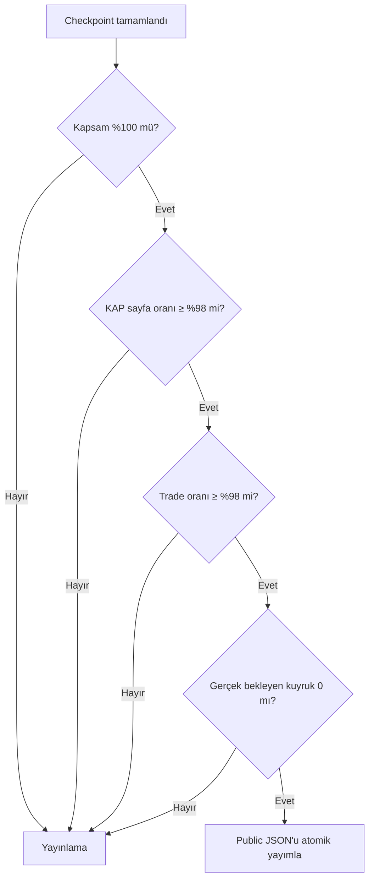

## 13. GitHub’a Uygulama

Repository köküne aynı klasör yapısıyla yalnız şu revize dosyaları yükleyin:

```text
.github/workflows/update-yat-kap-data.yml
scripts/update_yat_kap_data.py
scripts/tefas_profile_source.py
tests/test_parser.py
README.md
CHANGES_v2.7_v9.6_OPTIMIZE.md
VALIDATION_v2.7_v9.6.md
```

**`data/` klasörünü silmeyin veya paketle ezmeyin.** Mevcut workflow'da tamamlanıp commit edilmiş kayıtlar korunur. Devam eden workflow iptal edilirse yalnız o anda henüz commit edilmemiş runner değişiklikleri kaybolur; GitHub'daki kalıcı data bozulmaz.

### Uygulama Diyagramı

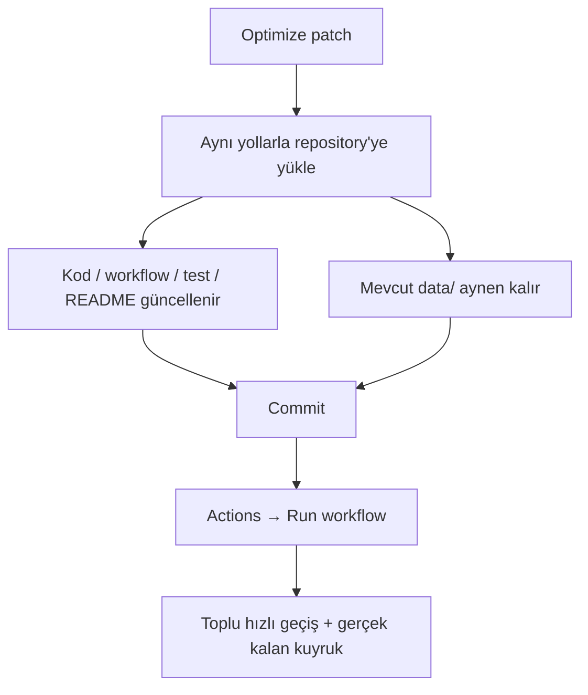

### Önerilen Çalıştırma Ayarları

```text
batch_size                  = 60
max_batches                 = 40
cooldown_seconds            = 180
delay_seconds               = 1.35
tefas_start_delay_min       = 15
tefas_start_delay_max       = 20
max_tefas_profile_attempts  = 3
```

## 14. Workflow Durumları

- `IN_PROGRESS`: Gerçek KAP kuyruğu, belirsiz profil veya retry var.
- `PUBLISHED`: Resmî JSON kalite eşiğini geçti ve güncellendi.
- `COMPLETE_WITH_UNRESOLVED`: Retry sınırı dolmuş kaynak problemleri var.

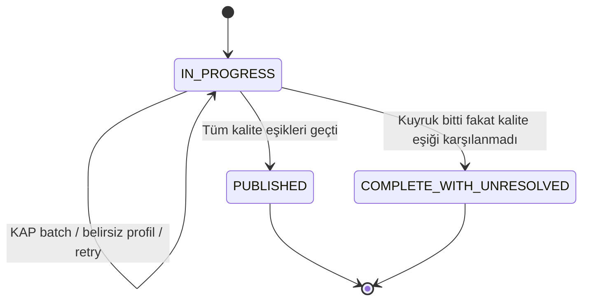

## 15. Public Adres

```text
https://raw.githubusercontent.com/GITHUB_KULLANICI_ADI/REPO_ADI/main/data/yat_fund_enrichment.json
```

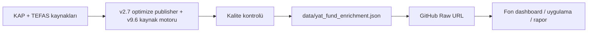

---

## 16. Windows Yerel Çalıştırma

`YEREL_TAM_TEST_BASLAT.bat`, GitHub workflow ile aynı `scripts/update_yat_kap_data.py` motorunu kullanır.

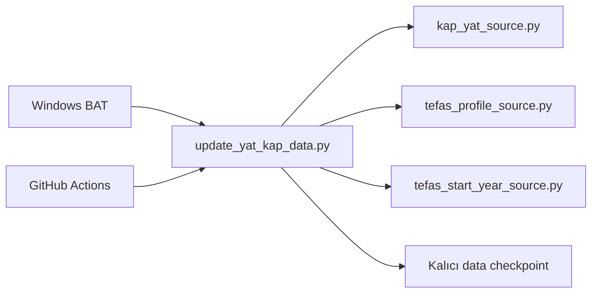

Yerel çalıştırma da mevcut `data/staging/yat_kap_progress.json` dosyasından devam eder. Playwright, OCR veya Tesseract üretim motorunun parçası değildir.
